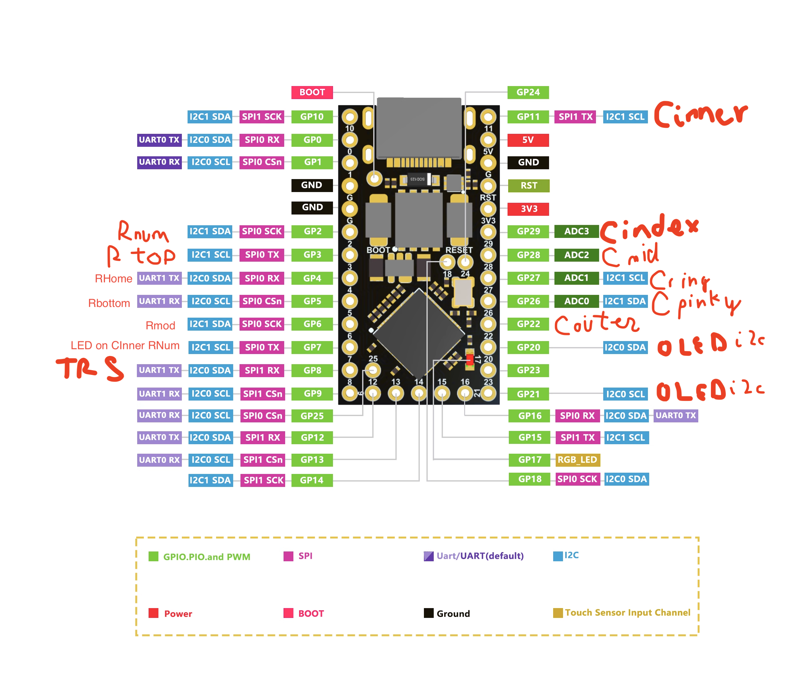
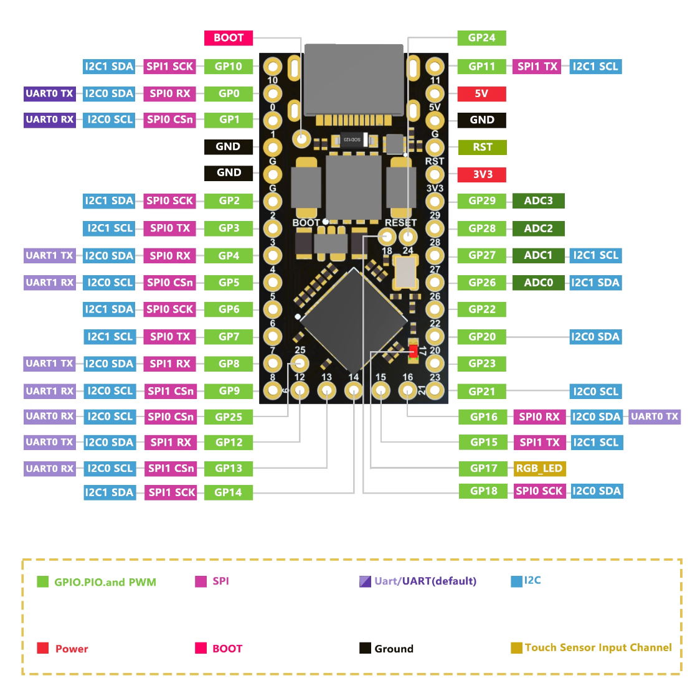
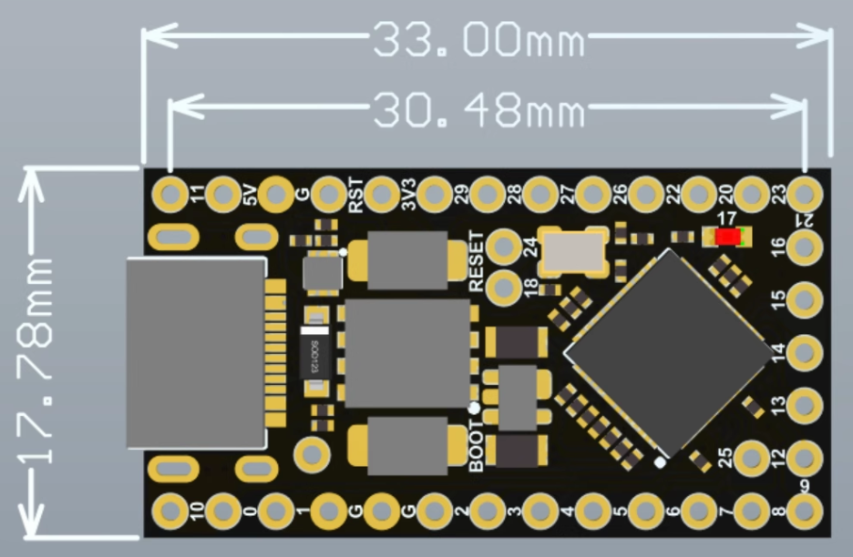

# Sofle Clone

It is actually not a very good clone.

## MCU Used - RP2040 Pro Micro AX
Please note I am new to this stuff so some may seem basic.

### Power
GPIO pins use 3.3v! But for all signals, this should be fine

* SK6812 ✅
* OLED ✅
* Keyboard Matrix ✅
* TRRS ✅

For Vcc Lines, the same components above should use 5V.
* SK6812 ✅
* OLED ❓
* Keyboard Matrix does not need a Vcc Line.
* TRRS ❓
### Used Pinout for Signals

* 11 Pins for Matrix
    * 6 cols - Cols on the Outer side
    * 5 rows - Rows on the Inner side?
* 1 Pin for Board Communication via TRRS cable
    * [Will use half duplex](https://github.com/qmk/qmk_firmware/blob/master/docs/serial_driver.md)
    * Should pick something towards the bottom with UART? Support?
* 1 Pin for SK6812
    * Use I2C0?
    * Should pick something near top left?
* 2 Pins for OLED via I2C
    * Can use any 2 pins I guess o_o
    * Use I2C1?
    * Something near bottom?

### Pinout Reference

### Dimensions Reference

__links__

https://www.nologo.tech/product/raspberrypie/RP2040ProMicro.html#%E5%B0%BA%E5%AF%B8%E5%9B%BE

